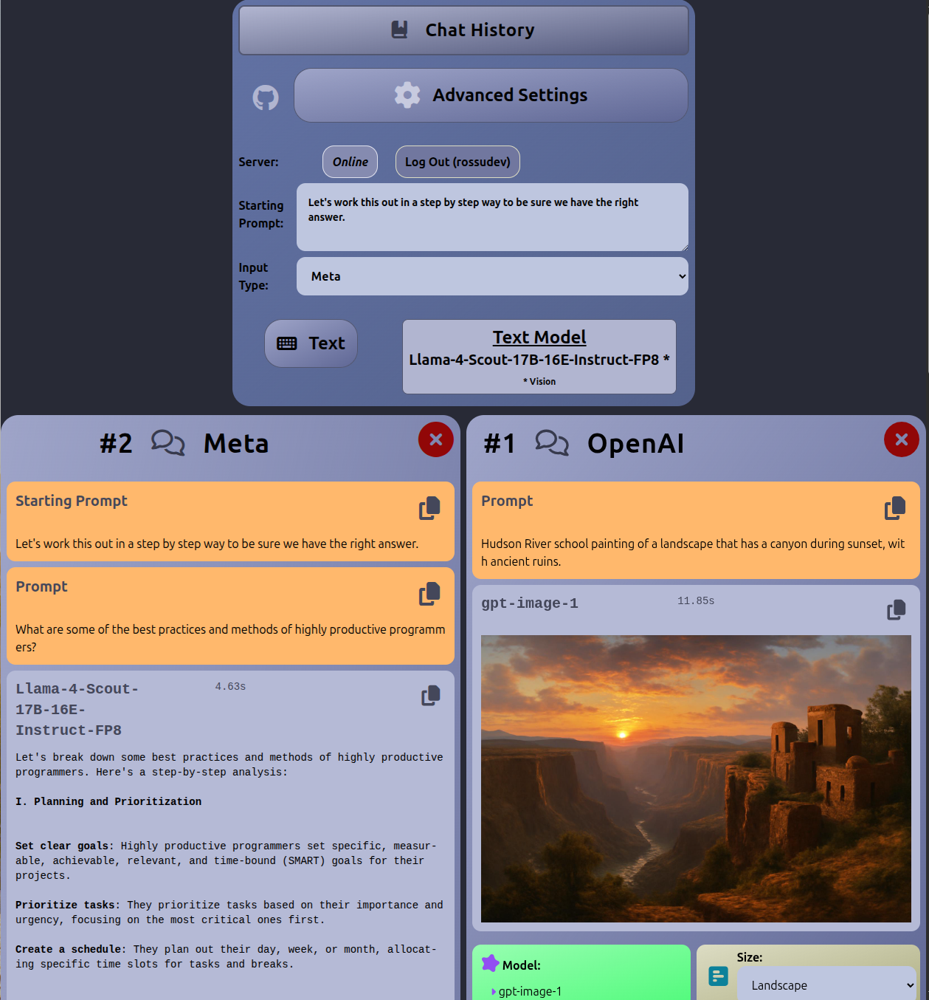

# LLM Chatter, v0.2.2

Large Language Model chat by text, vision and voice. Proprietary models by API request and local Ollama models supported.

## Screenshot

# Ollama Setup

1. Install Ollama and [add at least one model](https://www.ollama.ai/library).
   - `curl -fsSL https://ollama.com/install.sh | sh`

# Installation

1. `curl -fsSL https://raw.githubusercontent.com/rossudev/llm-chatter/master/install.sh | sh`
2. Configure .env file
   - [LLM_CHATTER_PASSPHRASE](https://bcrypt.online/) - The 'input' at bcrypt.online will be the app's passphrase, and required for logins. The generated hash is placed in .env.
   - [LLM_SERVER_HASH](https://duckduckgo.com/?q=generate+password+32+characters) - Any 32-character string.
   - [ANTHROPIC_API_KEY](https://www.anthropic.com/api)
   - [DEEPSEEK_API_KEY](https://platform.deepseek.com/api_keys)
   - [GOOGLE_API_KEY](https://ai.google.dev/gemini-api/docs/billing)
   - [GROK_API_KEY](https://console.x.ai/)
   - [OPENAI_API_KEY](https://platform.openai.com/account/billing)

# Starting and Stopping

- `cd llm-chatter`
- To start both server and client: `./start-all.sh`
- To stop both: `./stop-all.sh`

# Thanks!

Built with:

- [Vite](https://vitejs.dev/)
- [React](https://react.dev/)
- [TailwindCSS](https://tailwindcss.com/)
- [FontAwesome](https://fontawesome.com/)

# LLM Documentation

- [Anthropic](https://docs.anthropic.com/)
- [Deepseek](https://api-docs.deepseek.com/)
- [Google](https://ai.google.dev/gemini-api/docs)
- [Grok](https://docs.x.ai/docs)
- [Ollama](https://github.com/jmorganca/ollama/blob/main/docs/api.md)
- [OpenAI](https://platform.openai.com/docs/overview)

# Models List

- gpt-4.1\*
- gpt-4.1-mini\*
- gpt-4.1-nano\*
- gpt-image-1†
- chatgpt-4o\*
- o4-mini\*
- o3-mini
- o1\*
- o1-mini
- gpt-4o-realtime-preview (Audio In/Out)
- gpt-4o\*
- gpt-4o-mini\*
- gpt-4-turbo\*
- gpt-4
- gpt-3.5-turbo
- claude-3-7-sonnet\*
- claude-3-5-sonnet\*
- claude-3-5-haiku\*
- claude-3-opus\*
- claude-3-sonnet\*
- claude-3-haiku\*
- deepseek-chat (DeepSeek-V3)
- deepseek-reasoner (DeepSeek-R1)
- gemini-2.5-pro-preview-05-06
- gemini-2.5-pro-exp-03-25\*
- gemini-2.0-flash\*
- gemini-2.0-flash-preview-image-generation†
- gemini-1.5-pro\*
- gemini-1.5-flash\*
- gemini-1.5-flash-8b
- grok-3-beta
- grok-3-mini-beta
- grok-2
- grok-2-vision\*
- grok-vision-beta\*
- grok-beta
- llama-4-scout-17b-16e-instruct-fp8\*
- llama-4-maverick-17b-128e-instruct-fp8\*
- llama-3.3-70b-instruct
- llama-3.3-8b-instruct

  \*Vision input-image support (img/text in, text out)

†Output-image support (img/text in, img out)

# Ollama Vision Model List

- granite3.2-vision
- llava-phi3
- bakllava
- moondream
- llava-llama3
- minicpm-v
- llama3.2-vision
- llava
- gemma3
